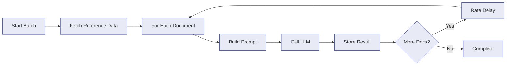

# AI Processing

Paperless NGX Dedupe can use large language models to classify your documents and suggest metadata -- title, correspondent, document type, tags, and existing Paperless custom fields -- with per-field confidence scores. Results are stored for review before anything is changed in Paperless-NGX.

## Setup

AI processing is disabled by default. Enable it with two environment variables:

| Variable | Required | Default | Notes |
| --- | --- | --- | --- |
| `AI_ENABLED` | No | `false` | Master switch for all AI features |
| `AI_OPENAI_API_KEY` | When AI enabled | - | OpenAI API key |

The API key is required when `AI_ENABLED=true`.

## Configuration

After enabling, configure processing behavior in **Settings > AI Processing** or via `PUT /api/v1/ai/config`. All settings are stored in the database and take effect immediately.

| Setting | Default | Range | Description |
| --- | --- | --- | --- |
| `provider` | `openai` | `openai` | LLM provider to use |
| `model` | `gpt-5.4-mini` | see below | Model identifier |
| `promptTemplate` | built-in | string | Prompt template with placeholders |
| `maxContentLength` | `8000` | 500--100,000 | Max characters of document text sent to the model |
| `batchSize` | `100` | 1--500 | Maximum concurrent AI requests |
| `rateDelayMs` | `0` | 0--60,000 | Delay (ms) between launching requests. 0 = auto-pacing |
| `maxOutputTokens` | `1000` | 1--100,000 | Maximum output tokens per request |
| `processedTagName` | `ai-processed` | string | Tag name added when suggestions are applied |
| `addProcessedTag` | `false` | boolean | Whether to add the processed tag on apply |
| `includeCorrespondents` | `false` | boolean | Send existing correspondents as reference data |
| `includeDocumentTypes` | `false` | boolean | Send existing document types as reference data |
| `includeTags` | `false` | boolean | Send existing tags as reference data |
| `extractTitle` | `true` | boolean | Include title recommendations in results |
| `extractCorrespondent` | `true` | boolean | Include correspondent recommendations in results |
| `extractDocumentType` | `true` | boolean | Include document-type recommendations in results |
| `extractTags` | `true` | boolean | Include tag recommendations in results |
| `extractCustomFields` | `false` | boolean | Recommend values for existing Paperless custom fields |
| `flexProcessing` | `true` | boolean | Use OpenAI Flex Processing for ~50% lower costs |
| `reasoningEffort` | `low` | `none`, `low`, `medium`, `high` | Reasoning effort level |
| `maxRetries` | `10` | 0--20 | Retry count on transient API failures |
| `confidenceThresholdGlobal` | `0` | 0--1 | Minimum confidence for all fields (floor) |
| `confidenceThresholdTitle` | `0` | 0--1 | Per-field override for title |
| `confidenceThresholdCorrespondent` | `0` | 0--1 | Per-field override for correspondent |
| `confidenceThresholdDocumentType` | `0` | 0--1 | Per-field override for document type |
| `confidenceThresholdTags` | `0` | 0--1 | Per-field override for tags |
| `protectedTagsEnabled` | `false` | boolean | Preserve configured tags during reviewed apply |
| `protectedTagNames` | `["email"]` | string array | Tags protected from AI-driven changes |
| `tagAliasesEnabled` | `false` | boolean | Normalize suggested tags through the alias map |
| `tagAliasMap` | built-in | YAML string | Canonical tag-to-alias mappings |
| `applyConcurrency` | `5` | 1--50 | Concurrent Paperless requests for a reviewed apply job |

AI processing can be scheduled under **Settings > Automation**. Scheduled processing is an
explicit opt-in and is disabled by default. It creates results for review; it never applies AI
suggestions to Paperless automatically.

### Available Models

| Model ID | Name |
| --- | --- |
| `gpt-5.4` | GPT-5.4 |
| `gpt-5.4-mini` | GPT-5.4 Mini |
| `gpt-5.4-nano` | GPT-5.4 Nano |

## How Processing Works

Processing runs as a background job with real-time progress via SSE:

1. **Fetch reference data** -- If the corresponding toggles are enabled, current correspondents, document types, tags, and custom-field definitions are fetched from Paperless-NGX and included in the prompt.

2. **For each document** -- The document's text is truncated to `maxContentLength` (preserving the beginning and end), combined with the prompt template, and sent to the configured provider.

3. **Store result** -- The model's structured response (suggested title, correspondent, document type, up to 5 tags, custom-field values, and confidence scores) is validated and stored in the database. Select labels are converted to Paperless option IDs, and invalid values are discarded. If processing fails for a document, the error is stored instead.

4. **Rate delay** -- A configurable pause between API calls prevents rate-limit errors.

Documents without text content are skipped automatically. When re-processing, existing results are overwritten.

## Reviewing Results

Open the **AI Processing** page to review suggestions. Each result shows:

- The document title
- Current vs. suggested title, correspondent, document type, tags, and custom fields
- Per-field confidence scores (color-coded: green >= 80%, yellow >= 50%, red < 50%)
- An evidence snippet from the document

### Status Lifecycle

Results move through these statuses:

| Status | Meaning |
| --- | --- |
| `pending_review` | Awaiting human review |
| `applied` | All suggested fields applied to Paperless-NGX |
| `partial` | Some fields applied (e.g., only correspondent and tags) |
| `rejected` | Dismissed by user |
| `reverted` | Previously applied result restored to its pre-apply state |
| `failed` | AI extraction failed (see error message for details) |

### Applying Suggestions

When you apply a result:

1. Each suggested name is resolved to its Paperless-NGX ID (case-insensitive match)
2. If a correspondent, document type, or tag does not exist, it is **created automatically** in Paperless-NGX
3. The document is updated via the Paperless-NGX API
4. If `addProcessedTag` is enabled, the configured tag is also added

You can apply all fields at once, or select specific fields for partial application. Batch apply and batch reject are supported for bulk review.

Custom fields use a live read-modify-write operation because Paperless replaces the complete
`custom_fields` list on update. Unrelated values are preserved. The before and after lists are
captured in the apply audit record and restored by revert. Custom fields are review-only and are
not included in automatic application.

By default, applying a result will not clear existing Paperless-NGX metadata when the AI has no suggestion for a field. Pass `allowClearing: true` in the API to explicitly allow clearing. New entities (correspondents, document types, tags) are created automatically unless `createMissingEntities: false` is specified.

### Reverting Applied Results

Applied or partially applied results can be reverted to restore the document's pre-apply state in Paperless-NGX. Revert uses the audit snapshot recorded at apply time to restore the original title, correspondent, document type, tags, and custom fields. Results applied before audit tracking was introduced cannot be reverted.

## Discovering Custom Fields

The **AI Processing > Custom Fields** page analyses OCR already stored in the local database. It
finds recurring labelled values such as account numbers, payment status, or due dates, infers a
Paperless field type, and ranks candidates by coverage and confidence.

The discovery scan:

- reads local OCR only and makes no LLM calls
- excludes Paperless first-class metadata and fields that already exist
- reports examples or suggested select options
- does not create or change anything in Paperless

Use the recommendations as a reviewed schema-design aid. Create the fields you want in Paperless,
sync the app, then enable `extractCustomFields` to recommend per-document values for them.

Revert via the UI or `POST /api/v1/ai/results/:id/revert`.

### Processing Scopes

When starting a batch, you choose which documents to process:

| Scope | Description |
| --- | --- |
| `new_only` | Only documents without an existing AI result (default) |
| `failed_only` | Re-process only documents whose previous run failed |
| `selected_document_ids` | Process a specific set of document IDs |
| `current_filter` | Process documents matching the current filter criteria |
| `full_reprocess` | Re-process every document, overwriting existing results |

### Apply Scopes

When applying results in bulk, you choose which results to target:

| Scope | Description |
| --- | --- |
| `selected_result_ids` | Apply specific result IDs |
| `all_pending` | Apply all results in `pending_review` status |
| `current_filter` | Apply results matching the current filter criteria |

### Preflight Validation

Before applying results in bulk, you can run a preflight check (`POST /api/v1/ai/preflight`) to preview the impact. The preflight report shows:

- How many fields would change per category (title, correspondent, document type, tags, custom fields)
- Which new entities would be created
- How many results have low confidence
- How many results are no-ops (already matching)
- How many results would destructively clear existing values
- A confidence distribution breakdown (high/medium/low)
- Confidence evaluation showing how many results fall below the configured review thresholds

## Confidence Thresholds

Confidence thresholds highlight uncertain suggestions during review and preflight. Each
suggestion's per-field confidence score is checked against configurable thresholds:

- **Global threshold** (`confidenceThresholdGlobal`) -- floor applied to all fields
- **Per-field thresholds** (`confidenceThresholdTitle`, `confidenceThresholdCorrespondent`,
  `confidenceThresholdDocumentType`, `confidenceThresholdTags`) -- per-field overrides; the
  effective threshold is the higher of global and per-field

Thresholds do not authorize mutation. Every result remains review-only until an operator previews
and explicitly applies a selected set of fields.

## Cost Tracking

Per-result cost estimates are computed automatically using pricing data fetched from the LiteLLM public pricing index, which is refreshed every 24 hours. The cost statistics API (`GET /api/v1/ai/costs`) provides:

- Total cost across all AI processing
- Cost broken down by provider and model
- Cost over time (daily aggregation)
- Token usage by provider and model

Use `POST /api/v1/ai/costs/estimate` to estimate the cost of a batch before running it. The estimate uses historical average token counts when available, falling back to conservative defaults.

## Feedback

User actions on AI results are recorded as feedback for auditing and analysis:

- **Rejected** -- result dismissed by user, with an optional reason
- **Partial applied** -- some fields applied, some excluded
- **Corrected** -- user edited the AI's suggestion before applying

The feedback summary (`GET /api/v1/ai/feedback`) shows aggregate statistics including the most frequently rejected fields and common correction patterns. This data can help tune your prompt template and confidence thresholds.

## Provider Implementation Details

OpenAI extraction uses the **Responses API** (`responses.parse()`) with Zod-based structured output. This ensures the model returns a valid JSON object matching the extraction schema. The `reasoningEffort` setting controls the effort parameter when supported.

Key details:

- Uses `developer` role for the system prompt
- Structured output via `zodTextFormat`
- Handles refusal detection and incomplete response detection
- Reports cached token counts when available
- When `flexProcessing` is enabled, requests are submitted to OpenAI's Flex Processing tier for ~50% lower costs (with relaxed latency SLA)

## Prompt Customization

The built-in prompt works well for general document classification. For specialized libraries you can edit the prompt template in Settings.

The template supports these placeholders:

| Placeholder | Replaced With |
| --- | --- |
| `{{existing_correspondents}}` | Comma-separated list of existing correspondent names (when `includeCorrespondents` is enabled) |
| `{{existing_document_types}}` | Comma-separated list of existing document type names (when `includeDocumentTypes` is enabled) |
| `{{existing_tags}}` | Comma-separated list of existing tag names (when `includeTags` is enabled) |

The document title and text content are included automatically in the user prompt (not the system prompt template). They do not need placeholders.

The prompt uses markdown sections for structure.

!!! tip "Enable reference data for better matching"
    Turning on `includeCorrespondents`, `includeDocumentTypes`, and `includeTags` helps the model reuse your existing names rather than inventing new ones. This is especially useful for established libraries.

## Tips

!!! info "Best practices"
    - **Start small** -- Process a handful of documents first to verify the prompt produces good results before running a full batch.
    - **Tune `maxContentLength`** -- Lower values reduce cost; higher values give the model more context. 8,000 characters is a good default for most documents.
    - **Use `rateDelayMs`** -- Provider rate limits vary by plan. Increase the delay if you hit 429 errors.
    - **`reasoningEffort`** -- Controls the OpenAI reasoning effort parameter. Higher effort may improve accuracy at the cost of latency and tokens.
    - **Review before applying** -- AI suggestions are not always correct. The confidence scores help prioritize review, but always verify before applying to Paperless-NGX.

## See Also

- [Configuration](configuration.md) -- environment variables and runtime settings
- [API Reference](api-reference.md#ai-processing) -- AI REST API endpoints
- [How It Works](how-it-works.md) -- the deduplication pipeline
