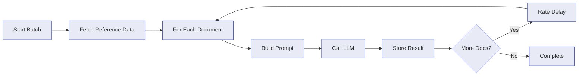

# AI Processing

Paperless NGX Dedupe can use large language models to classify your documents and suggest metadata -- correspondent, document type, and tags -- with per-field confidence scores. Results are stored for review before anything is changed in Paperless-NGX.

## Setup

AI processing is disabled by default. Enable it with two environment variables:

| Variable | Required | Default | Notes |
| --- | --- | --- | --- |
| `AI_ENABLED` | No | `false` | Master switch for all AI features |
| `AI_OPENAI_API_KEY` | When using OpenAI | - | OpenAI API key |
| `AI_ANTHROPIC_API_KEY` | When using Anthropic | - | Anthropic API key |

At least one API key is required when `AI_ENABLED=true`. If both keys are provided, the active provider is selected in the Settings page.

## Configuration

After enabling, configure processing behavior in **Settings > AI Processing** or via `PUT /api/v1/ai/config`. All settings are stored in the database and take effect immediately.

| Setting | Default | Range | Description |
| --- | --- | --- | --- |
| `provider` | `openai` | `openai`, `anthropic` | LLM provider to use |
| `model` | `gpt-5.4-mini` | see below | Model identifier |
| `promptTemplate` | built-in | string | Prompt template with placeholders |
| `maxContentLength` | `8000` | 500--100,000 | Max characters of document text sent to the model |
| `batchSize` | `10` | 1--100 | Documents per processing run |
| `rateDelayMs` | `500` | 0--60,000 | Delay (ms) between API calls |
| `autoProcess` | `false` | boolean | Auto-start processing after sync |
| `processedTagName` | `ai-processed` | string | Tag name added when suggestions are applied |
| `addProcessedTag` | `false` | boolean | Whether to add the processed tag on apply |
| `includeCorrespondents` | `false` | boolean | Send existing correspondents as reference data |
| `includeDocumentTypes` | `false` | boolean | Send existing document types as reference data |
| `includeTags` | `false` | boolean | Send existing tags as reference data |
| `reasoningEffort` | `low` | `none`, `low`, `medium`, `high` | Reasoning effort (OpenAI models that support it) |
| `maxRetries` | `3` | 0--10 | Retry count on transient API failures |

### Available Models

=== "OpenAI"

    | Model ID | Name |
    | --- | --- |
    | `gpt-5.4` | GPT-5.4 |
    | `gpt-5.4-mini` | GPT-5.4 Mini |
    | `gpt-5.4-nano` | GPT-5.4 Nano |

=== "Anthropic"

    | Model ID | Name |
    | --- | --- |
    | `claude-opus-4-6` | Claude Opus 4.6 |
    | `claude-sonnet-4-6` | Claude Sonnet 4.6 |
    | `claude-haiku-4-5` | Claude Haiku 4.5 |
    | `claude-opus-4-5` | Claude Opus 4.5 |
    | `claude-sonnet-4-5` | Claude Sonnet 4.5 |

## How Processing Works

Processing runs as a background job with real-time progress via SSE:

1. **Fetch reference data** -- If the `includeCorrespondents`, `includeDocumentTypes`, or `includeTags` toggles are enabled, the current lists are fetched from Paperless-NGX and included in the prompt so the model can match existing names.

2. **For each document** -- The document's text is truncated to `maxContentLength` (preserving the beginning and end), combined with the prompt template, and sent to the configured provider.

3. **Store result** -- The model's structured response (suggested correspondent, document type, up to 5 tags, and per-field confidence scores) is stored in the database. If processing fails for a document, the error is stored instead.

4. **Rate delay** -- A configurable pause between API calls prevents rate-limit errors.

Documents without text content are skipped automatically. When re-processing, existing results are overwritten.

## Reviewing Results

Open the **AI Processing** page to review suggestions. Each result shows:

- The document title
- Current vs. suggested correspondent, document type, and tags
- Per-field confidence scores (color-coded: green >= 80%, yellow >= 50%, red < 50%)
- An evidence snippet from the document

### Status Lifecycle

Results move through these statuses:

| Status | Meaning |
| --- | --- |
| `pending` | Awaiting review |
| `applied` | All suggested fields applied to Paperless-NGX |
| `partial` | Some fields applied (e.g., only correspondent and tags) |
| `rejected` | Dismissed by user |

### Applying Suggestions

When you apply a result:

1. Each suggested name is resolved to its Paperless-NGX ID (case-insensitive match)
2. If a correspondent, document type, or tag does not exist, it is **created automatically** in Paperless-NGX
3. The document is updated via the Paperless-NGX API
4. If `addProcessedTag` is enabled, the configured tag is also added

You can apply all fields at once, or select specific fields for partial application. Batch apply and batch reject are supported for bulk review.

## Prompt Customization

The built-in prompt works well for general document classification. For specialized libraries you can edit the prompt template in Settings.

The template supports these placeholders:

| Placeholder | Replaced With |
| --- | --- |
| `{{referenceData}}` | Lists of existing correspondents, document types, and tags (when toggles are enabled) |
| `{{examples}}` | Built-in few-shot classification examples |
| `{{title}}` | Document title |
| `{{content}}` | Truncated document text |

The prompt is automatically formatted for the active provider -- XML tags for Anthropic, markdown sections for OpenAI.

!!! tip "Enable reference data for better matching"
    Turning on `includeCorrespondents`, `includeDocumentTypes`, and `includeTags` helps the model reuse your existing names rather than inventing new ones. This is especially useful for established libraries.

## Tips

!!! info "Best practices"
    - **Start small** -- Process a handful of documents first to verify the prompt produces good results before running a full batch.
    - **Tune `maxContentLength`** -- Lower values reduce cost; higher values give the model more context. 8,000 characters is a good default for most documents.
    - **Use `rateDelayMs`** -- Provider rate limits vary by plan. Increase the delay if you hit 429 errors.
    - **`reasoningEffort`** -- Only affects OpenAI models that support it. Higher effort may improve accuracy at the cost of latency and tokens.
    - **Review before applying** -- AI suggestions are not always correct. The confidence scores help prioritize review, but always verify before applying to Paperless-NGX.

## See Also

- [Configuration](configuration.md) -- environment variables and runtime settings
- [API Reference](api-reference.md#ai-processing) -- AI REST API endpoints
- [How It Works](how-it-works.md) -- the deduplication pipeline
