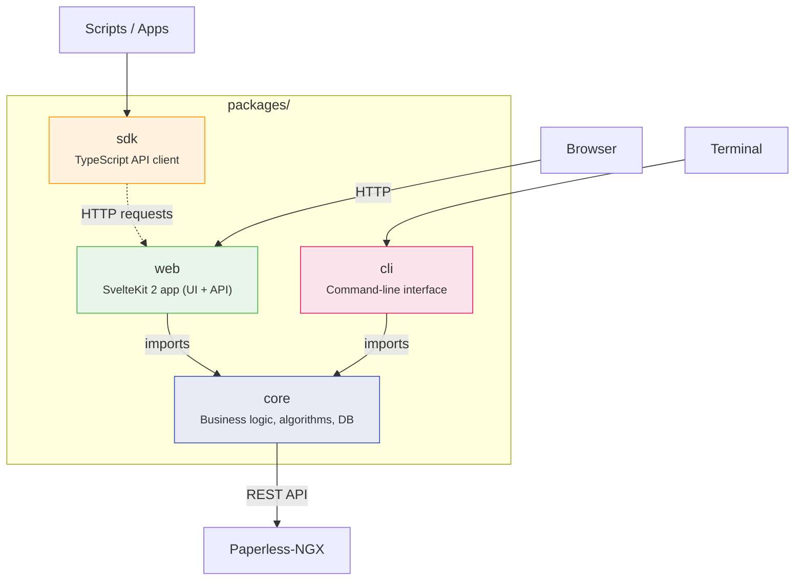
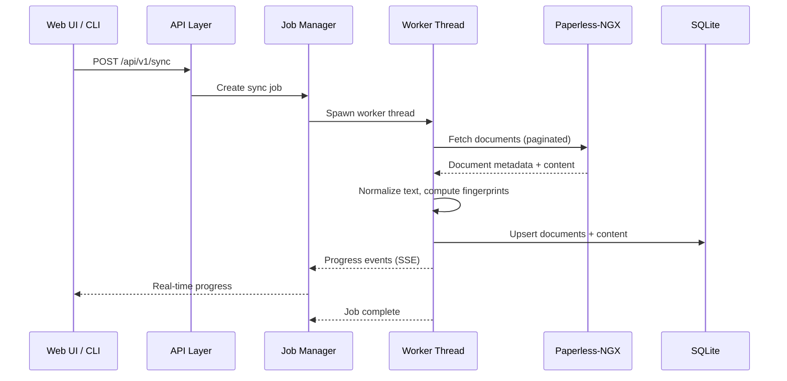
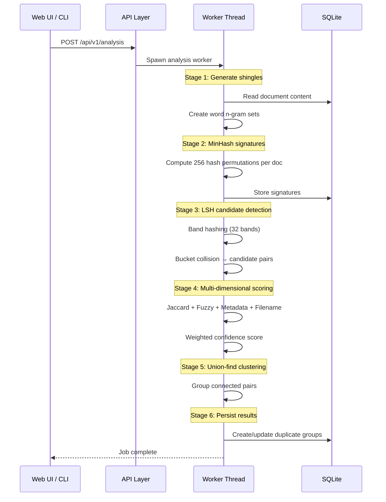
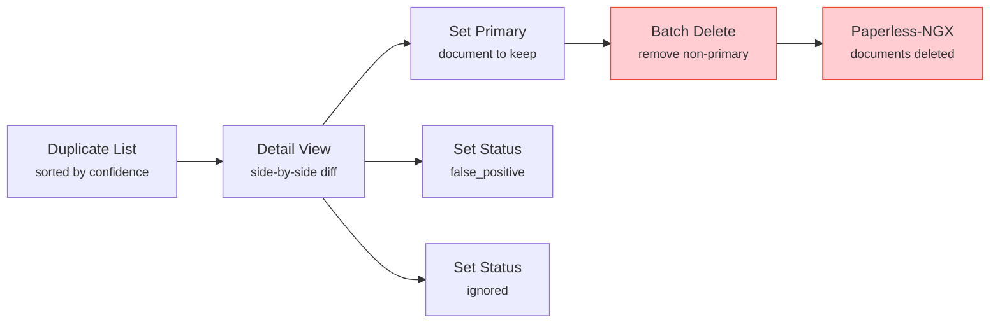

# Architecture

Paperless NGX Dedupe is a pnpm monorepo with four packages that separate concerns cleanly between business logic, web interface, programmatic access, and CLI tooling.

## Monorepo Overview



### packages/core

Framework-agnostic TypeScript library containing all business logic. No web framework dependencies — can be reused by the CLI, future tools, or SDKs that operate directly on the database.

**Key modules:**

- `dedup/` -- MinHash signatures, LSH indexing, fuzzy matching, multi-dimensional scoring, union-find clustering
- `sync/` -- Document sync from Paperless-NGX, text normalization, fingerprinting
- `jobs/` -- Worker thread launcher and job queue manager
- `queries/` -- Database queries via Drizzle ORM (documents, duplicates, dashboard, config)
- `schema/` -- Drizzle ORM table definitions and relations
- `paperless/` -- Paperless-NGX REST API client with Zod schema validation
- `export/` -- CSV and JSON export utilities
- `config.ts` -- Zod-validated environment configuration

### packages/web

SvelteKit 2 application (Svelte 5 runes) that serves both the web UI and the REST API. Uses `adapter-node` for Docker deployment.

**Key areas:**

- `routes/api/v1/` -- REST API endpoints matching the [API Reference](api-reference.md)
- `routes/` -- UI pages: dashboard, documents, duplicates (with detail, graph, and wizard views), settings
- `lib/components/` -- Reusable Svelte components (DocumentCompare, TextDiff, etc.)
- `lib/server/` -- Server-side utilities (database connection, API helpers)
- `hooks.server.ts` -- SvelteKit server hooks for request processing

### packages/sdk

Typed TypeScript client for the REST API. Zero dependencies on `core` — communicates over HTTP.

- `client.ts` -- `PaperlessDedupeClient` class with methods for every API endpoint
- `types.ts` -- Full type definitions for all request/response shapes
- `errors.ts` -- Typed error classes (API errors, network errors)
- `sse.ts` -- Server-Sent Events subscription for job progress

### packages/cli

Command-line interface using Commander.js. Imports `core` directly (no web server required).

- Commands: `sync`, `analyze`, `status`, `config show/set`, `export duplicates/config`
- Supports `--json` flag for machine-readable output
- See [CLI Reference](cli-reference.md) for full documentation

## Key Technical Choices

| Area | Choice | Rationale |
|------|--------|-----------|
| **Database** | SQLite + Drizzle ORM | Single-file database, no external dependency, excellent for single-container deployment |
| **Background Jobs** | `worker_threads` + SQLite job queue | No Redis needed. One job per type at a time prevents resource contention |
| **Real-time Progress** | Server-Sent Events (SSE) | Simpler than WebSockets for unidirectional progress streams |
| **Dedup Algorithms** | Pure TypeScript MinHash/LSH | No native dependencies beyond `better-sqlite3`. Defaults: 256 permutations, 32 bands |
| **Validation** | Zod | TypeScript-first schemas for env config and API requests |
| **Logging** | Pino | Fast structured JSON logging |
| **Styling** | Tailwind CSS 4 | Utility-first CSS via Vite plugin |

## Data Flow

### Sync Pipeline



### Analysis Pipeline



### Review Flow



## Database Schema

The SQLite database contains 8 tables:

```mermaid
erDiagram
    document ||--o| documentContent : "has content"
    document ||--o| documentSignature : "has signature"
    document ||--o{ duplicateMember : "belongs to groups"
    duplicateGroup ||--|{ duplicateMember : "contains members"
    job ||--o| job : "self-referencing"

    document {
        text id PK
        int paperlessId UK
        text title
        text correspondent
        text documentType
        text tags
        text createdDate
        text fingerprint
    }

    documentContent {
        text documentId PK_FK
        text fullText
        text normalizedText
        int wordCount
        text contentHash
    }

    documentSignature {
        text documentId PK_FK
        blob signature
        text contentHash
    }

    duplicateGroup {
        text id PK
        real confidenceScore
        real jaccardSimilarity
        real fuzzyTextRatio
        real metadataSimilarity
        real filenameSimilarity
        text status
    }

    duplicateMember {
        text id PK
        text groupId FK
        text documentId FK
        int isPrimary
    }

    job {
        text id PK
        text type
        text status
        real progress
        text progressMessage
        text startedAt
        text completedAt
        text errorMessage
        text resultJson
        text createdAt
    }

    appConfig {
        text key PK
        text value
        text updatedAt
    }

    syncState {
        text id PK
        text lastSyncAt
        int lastSyncDocumentCount
        text lastAnalysisAt
        int totalDocuments
        int totalDuplicateGroups
    }
```

## Worker Thread Architecture

Background jobs run in Node.js `worker_threads` to avoid blocking the main event loop:

- **Job Manager** (`packages/core/src/jobs/manager.ts`): Creates job records in SQLite, spawns worker threads, monitors completion
- **Worker Launcher** (`packages/core/src/jobs/worker-launcher.ts`): Generic worker spawning and crash handling
- **Workers** (`packages/core/src/jobs/workers/`): Specialized workers for sync, analysis, and batch operations

**Constraints:**

- Only **one job per type** can run at a time (enforced by the job queue)
- Workers persist progress to the `job` table
- The API polls that job state and streams it via SSE at `/api/v1/jobs/:jobId/progress`
- Stale jobs (from crashed workers) are recovered on startup

## API Layer

The REST API is implemented as SvelteKit server routes at `packages/web/src/routes/api/v1/`:

```
api/v1/
├── health/                    # GET
├── ready/                     # GET
├── dashboard/                 # GET
├── sync/                      # POST
├── sync/status/               # GET
├── analysis/                  # POST
├── analysis/status/           # GET
├── jobs/                      # GET
├── jobs/:jobId                # GET
├── jobs/:jobId/progress       # GET (SSE)
├── jobs/:jobId/cancel         # POST
├── config/                    # GET, PUT
├── config/dedup               # GET, PUT
├── config/test-connection     # POST
├── documents/                 # GET
├── documents/:id              # GET
├── documents/stats            # GET
├── duplicates/                # GET
├── duplicates/:id             # GET, DELETE
├── duplicates/:id/content     # GET
├── duplicates/:id/status      # PUT
├── duplicates/:id/primary     # PUT
├── duplicates/stats           # GET
├── duplicates/graph           # GET
├── batch/status               # POST
├── batch/delete-non-primary   # POST
├── export/duplicates.csv      # GET
├── export/config.json         # GET
├── import/config              # POST
└── paperless/*                # Proxy/helper endpoints used by the UI
```

All endpoints follow a consistent response envelope pattern documented in the [API Reference](api-reference.md#conventions).
