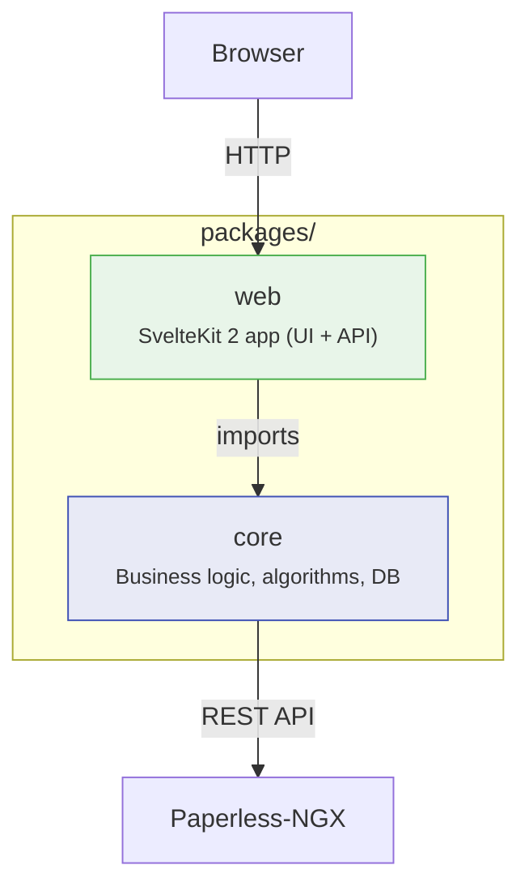
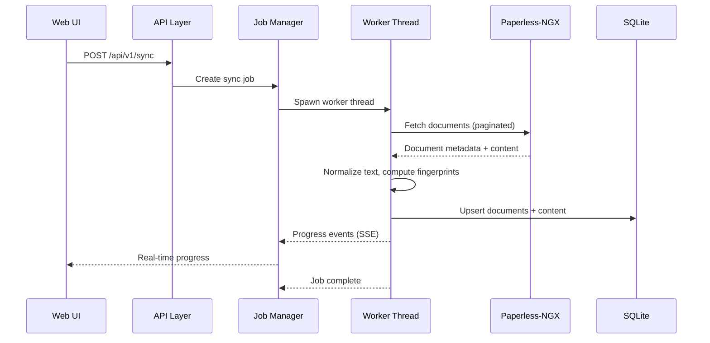
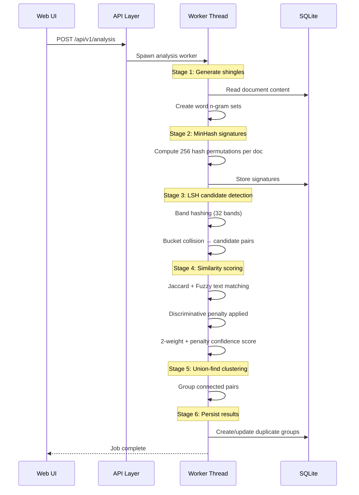
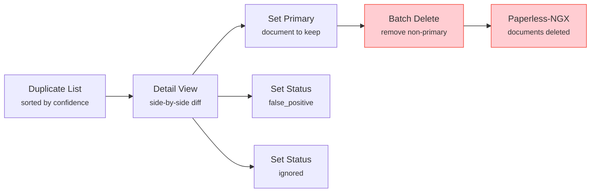

# Architecture

Paperless NGX Dedupe is a pnpm monorepo with two packages that separate concerns cleanly between business logic and the web interface.

## Monorepo Overview


```mermaid
graph TD
    subgraph "packages/"
        Core["core<br/><small>Business logic, algorithms, DB</small>"]
        Web["web<br/><small>SvelteKit 2 app (UI + API)</small>"]
    end

    Web -->|"imports"| Core

    Paperless["Paperless-NGX"]
    Browser["Browser"]

    Browser -->|"HTTP"| Web
    Core -->|"REST API"| Paperless

    style Core fill:#e8eaf6,stroke:#3f51b5
    style Web fill:#e8f5e9,stroke:#4caf50
```

### packages/core

Framework-agnostic TypeScript library containing all business logic. No web framework dependencies.

**Key modules:**

- `dedup/` -- MinHash signatures, LSH indexing, fuzzy matching, discriminative scoring, union-find clustering
- `sync/` -- Document sync from Paperless-NGX, text normalization, fingerprinting
- `jobs/` -- Worker thread launcher and job queue manager
- `queries/` -- Database queries via Drizzle ORM (documents, duplicates, dashboard, config)
- `schema/` -- Drizzle ORM table definitions and relations
- `paperless/` -- Paperless-NGX REST API client with Zod schema validation
- `ai/` -- AI-powered metadata extraction (OpenAI), auto-apply, cost tracking, feedback
- `rag/` -- Retrieval-augmented generation: document chunking, embeddings, vector search, conversations
- `export/` -- CSV and JSON export utilities
- `telemetry/` -- OpenTelemetry tracing and metrics instrumentation
- `config.ts` -- Zod-validated environment configuration

### packages/web

SvelteKit 2 application (Svelte 5 runes) that serves both the web UI and the REST API. Uses `adapter-node` for Docker deployment.

**Key areas:**

- `routes/api/v1/` -- REST API endpoints matching the [API Reference](api-reference.md)
- `routes/` -- UI pages: dashboard, documents, duplicates (detail, graph, wizard), AI processing (queue, review, history), RAG ask, settings
- `lib/components/` -- Reusable Svelte components (DocumentCompare, TextDiff, etc.)
- `lib/server/` -- Server-side utilities (database connection, API helpers)
- `hooks.server.ts` -- SvelteKit server hooks for request processing

## Key Technical Choices

| Area | Choice | Rationale |
|------|--------|-----------|
| **Database** | SQLite + Drizzle ORM | Single-file database, no external dependency, excellent for single-container deployment |
| **Background Jobs** | `worker_threads` + SQLite job queue | No Redis needed. One job per type at a time prevents resource contention |
| **Real-time Progress** | Server-Sent Events (SSE) | Simpler than WebSockets for unidirectional progress streams |
| **Dedup Algorithms** | Pure TypeScript MinHash/LSH | No native dependencies beyond `better-sqlite3`. Defaults: 256 permutations, 32 bands |
| **Vector Search** | `sqlite-vec` | SQLite extension for RAG embedding storage and similarity search |
| **AI Providers** | OpenAI (via Vercel AI SDK) | Optional metadata extraction and RAG conversations |
| **Validation** | Zod | TypeScript-first schemas for env config and API requests |
| **Logging** | Pino | Fast structured JSON logging |
| **Telemetry** | OpenTelemetry | Distributed tracing and metrics (optional) |
| **Styling** | Tailwind CSS 4 | Utility-first CSS via Vite plugin |

## Data Flow

### Sync Pipeline


```mermaid
sequenceDiagram
    participant UI as Web UI
    participant API as API Layer
    participant JM as Job Manager
    participant W as Worker Thread
    participant P as Paperless-NGX
    participant DB as SQLite

    UI->>API: POST /api/v1/sync
    API->>JM: Create sync job
    JM->>W: Spawn worker thread
    W->>P: Fetch documents (paginated)
    P-->>W: Document metadata + content
    W->>W: Normalize text, compute fingerprints
    W->>DB: Upsert documents + content
    W-->>JM: Progress events (SSE)
    JM-->>UI: Real-time progress
    W-->>JM: Job complete
```

### Analysis Pipeline


```mermaid
sequenceDiagram
    participant UI as Web UI
    participant API as API Layer
    participant W as Worker Thread
    participant DB as SQLite

    UI->>API: POST /api/v1/analysis
    API->>W: Spawn analysis worker

    Note over W: Stage 1: Generate shingles
    W->>DB: Read document content
    W->>W: Create word n-gram sets

    Note over W: Stage 2: MinHash signatures
    W->>W: Compute 256 hash permutations per doc
    W->>DB: Store signatures

    Note over W: Stage 3: LSH candidate detection
    W->>W: Band hashing (32 bands)
    W->>W: Bucket collision → candidate pairs

    Note over W: Stage 4: Similarity scoring
    W->>W: Jaccard + Fuzzy text matching
    W->>W: Discriminative penalty applied
    W->>W: 2-weight + penalty confidence score

    Note over W: Stage 5: Union-find clustering
    W->>W: Group connected pairs

    Note over W: Stage 6: Persist results
    W->>DB: Create/update duplicate groups
    W-->>UI: Job complete
```

### Review Flow


```mermaid
flowchart LR
    List["Duplicate List<br/><small>sorted by confidence</small>"] --> Detail["Detail View<br/><small>side-by-side diff</small>"]
    Detail --> Primary["Set Primary<br/><small>document to keep</small>"]
    Detail --> FalsePositive["Set Status<br/><small>false_positive</small>"]
    Detail --> Ignored["Set Status<br/><small>ignored</small>"]
    Primary --> Batch["Batch Delete<br/><small>remove non-primary</small>"]
    Batch --> Paperless["Paperless-NGX<br/><small>documents deleted</small>"]

    style Batch fill:#ffcdd2,stroke:#f44336
    style Paperless fill:#ffcdd2,stroke:#f44336
```

## Database Schema

The SQLite database contains 11 tables (plus a virtual table for vector embeddings):

```mermaid
erDiagram
    document ||--o| documentContent : "has content"
    document ||--o| documentSignature : "has signature"
    document ||--o{ duplicateMember : "belongs to groups"
    document ||--o| aiProcessingResult : "has AI result"
    document ||--o{ documentChunk : "has chunks"
    duplicateGroup ||--|{ duplicateMember : "contains members"
    ragConversation ||--|{ ragMessage : "contains messages"

    document {
        text id PK
        int paperlessId UK
        text title
        text fingerprint
        text correspondent
        text documentType
        text tagsJson
        text createdDate
        text addedDate
        text modifiedDate
        text processingStatus
        text syncedAt
    }

    documentContent {
        text id PK
        text documentId FK_UK
        text fullText
        text normalizedText
        int wordCount
        text contentHash
    }

    documentSignature {
        text id PK
        text documentId FK_UK
        blob minhashSignature
        text algorithmVersion
        int numPermutations
        text createdAt
    }

    duplicateGroup {
        text id PK
        real confidenceScore
        real jaccardSimilarity
        real fuzzyTextRatio
        real discriminativeScore
        text algorithmVersion
        text status
        text createdAt
        text updatedAt
    }

    duplicateMember {
        text id PK
        text groupId FK
        text documentId FK
        int isPrimary
    }

    job {
        text id PK
        text type
        text status
        real progress
        real phaseProgress
        text progressMessage
        text startedAt
        text completedAt
        text errorMessage
        text resultJson
        text createdAt
    }

    appConfig {
        text key PK
        text value
        text updatedAt
    }

    syncState {
        text id PK
        text lastSyncAt
        int lastSyncDocumentCount
        text lastAnalysisAt
        int totalDocuments
        int totalDuplicateGroups
        int cumulativeGroupsActioned
        int cumulativeDocumentsDeleted
    }

    aiProcessingResult {
        text id PK
        text documentId FK_UK
        int paperlessId
        text provider
        text model
        text suggestedCorrespondent
        text suggestedDocumentType
        text suggestedTagsJson
        text confidenceJson
        text appliedStatus
        text appliedAt
        text evidence
        text failureType
        int promptTokens
        int completionTokens
        real estimatedCostUsd
        text createdAt
    }

    documentChunk {
        text id PK
        text documentId FK
        int chunkIndex
        text content
        int tokenCount
        text metadata
        text contentHash
        text embeddingModel
        text createdAt
    }

    ragConversation {
        text id PK
        text title
        text createdAt
        text updatedAt
    }

    ragMessage {
        text id PK
        text conversationId FK
        text role
        text content
        text sourcesJson
        int tokenUsage
        text createdAt
    }
```

## Worker Thread Architecture

Background jobs run in Node.js `worker_threads` to avoid blocking the main event loop:

- **Job Manager** (`packages/core/src/jobs/manager.ts`): Creates job records in SQLite, spawns worker threads, monitors completion
- **Worker Launcher** (`packages/core/src/jobs/worker-launcher.ts`): Generic worker spawning and crash handling
- **Worker Paths** (`packages/core/src/jobs/worker-paths.ts`): Resolves worker module paths across dev, built, and Docker environments
- **Workers** (`packages/core/src/jobs/workers/`): Specialized workers:
    - `sync-worker` -- Document sync from Paperless-NGX
    - `analysis-worker` -- MinHash/LSH dedup analysis
    - `batch-worker` -- Batch delete operations
    - `ai-processing-worker` -- AI metadata extraction
    - `ai-apply-worker` -- Apply AI suggestions to Paperless-NGX
    - `rag-indexing-worker` -- RAG document chunking and embedding

**Constraints:**

- Only **one job per type** can run at a time (enforced by the job queue)
- Workers persist progress to the `job` table
- The API polls that job state and streams it via SSE at `/api/v1/jobs/:jobId/progress`
- Stale jobs (from crashed workers) are recovered on startup

## API Layer

The REST API is implemented as SvelteKit server routes at `packages/web/src/routes/api/v1/`:

```
api/v1/
├── health/                         # GET
├── ready/                          # GET
├── metrics/                        # GET (Prometheus)
├── dashboard/                      # GET
├── sync/                           # POST
├── sync/status/                    # GET
├── analysis/                       # POST
├── analysis/status/                # GET
├── jobs/                           # GET
├── jobs/:jobId                     # GET
├── jobs/:jobId/progress            # GET (SSE)
├── jobs/:jobId/cancel              # POST
├── config/                         # GET, PUT
├── config/dedup                    # GET, PUT
├── config/test-connection          # POST
├── documents/                      # GET
├── documents/:id                   # GET
├── documents/:id/content           # GET
├── documents/stats                 # GET
├── duplicates/                     # GET
├── duplicates/:id                  # GET, DELETE
├── duplicates/:id/content          # GET
├── duplicates/:id/status           # PUT
├── duplicates/:id/primary          # PUT
├── duplicates/stats                # GET
├── duplicates/graph                # GET
├── batch/status                    # POST
├── batch/delete-non-primary        # POST
├── batch/purge-deleted             # POST
├── export/duplicates.csv           # GET
├── export/config.json              # GET
├── import/config                   # POST
├── ai/config                       # GET, PUT
├── ai/models                       # GET
├── ai/process                      # POST
├── ai/stats                        # GET
├── ai/costs                        # GET
├── ai/costs/estimate               # POST
├── ai/feedback/summary             # GET
├── ai/results/                     # GET
├── ai/results/groups               # GET
├── ai/results/preflight            # POST
├── ai/results/batch-apply          # POST
├── ai/results/apply-all            # POST
├── ai/results/batch-reject         # POST
├── ai/results/reject-all           # POST
├── ai/results/:id                  # GET, DELETE
├── ai/results/:id/apply            # POST
├── ai/results/:id/reject           # POST
├── ai/results/:id/revert           # POST
├── ai/results/:id/feedback         # POST
├── rag/config                      # GET, PUT
├── rag/index                       # POST
├── rag/stats                       # GET
├── rag/ask                         # POST
├── rag/conversations               # GET, POST
├── rag/conversations/:id           # GET, DELETE
└── paperless/*                     # Proxy/helper endpoints used by the UI
```

All endpoints follow a consistent response envelope pattern documented in the [API Reference](api-reference.md#conventions).
