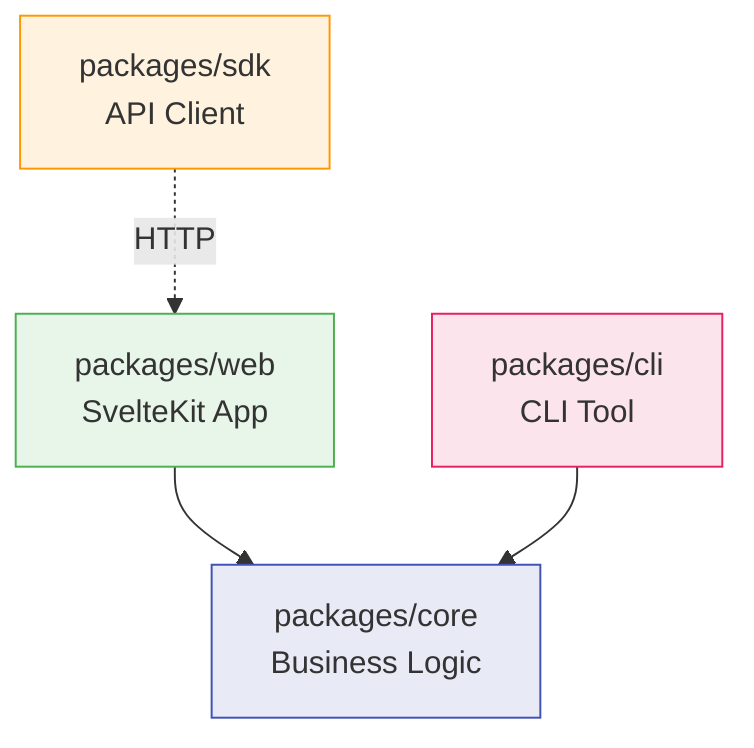

# Development Guide

This guide covers setting up a local development environment, running tests, and understanding the project structure.

## Prerequisites

- **Node.js** 22 or later
- **pnpm** 9.15 or later
- **Git**

## Setup

```bash
# Clone the repository
git clone https://github.com/rknightion/paperless-ngx-dedupe.git
cd paperless-ngx-dedupe

# Install dependencies
pnpm install

# Copy environment configuration
cp .env.example .env
# Edit .env — set PAPERLESS_URL and PAPERLESS_API_TOKEN

# Start the development server
pnpm dev
# Opens at http://localhost:5173
```

!!! warning "Worker Thread Limitation"
    Background jobs (sync, analysis, batch delete) use `worker_threads` that run as raw Node.js processes outside Vite. These do **not** work with `pnpm dev` because Node.js cannot execute the TypeScript source files directly. Use `docker compose up` to test the full workflow including background jobs.

## Project Structure

```
paperless-ngx-dedupe/
├── packages/
│   ├── core/           # Framework-agnostic business logic
│   │   └── src/
│   │       ├── dedup/      # MinHash, LSH, scoring, analysis
│   │       ├── sync/       # Document sync and normalization
│   │       ├── jobs/       # Worker thread management
│   │       ├── queries/    # Database queries (Drizzle ORM)
│   │       ├── schema/     # Database schema definitions
│   │       ├── paperless/  # Paperless-NGX API client
│   │       ├── export/     # CSV and JSON export
│   │       └── config.ts   # Zod-validated environment config
│   ├── web/            # SvelteKit 2 application
│   │   └── src/
│   │       ├── routes/     # UI pages and API endpoints
│   │       └── lib/        # Shared components and utilities
│   ├── sdk/            # TypeScript API client library
│   │   └── src/
│   │       ├── client.ts   # PaperlessDedupeClient class
│   │       └── types.ts    # Exported type definitions
│   └── cli/            # Command-line interface
│       └── src/
│           ├── commands/   # sync, analyze, status, config, export
│           └── lib/        # CLI utilities
├── docs/               # Documentation (this site)
├── Dockerfile          # Multi-stage Docker build
├── docker-compose.yml  # Development/production compose
└── pnpm-workspace.yaml # Monorepo workspace config
```

## Package Dependencies



- **core**: No framework dependencies. All business logic lives here.
- **web**: Imports `@paperless-dedupe/core` directly. Serves both the UI and REST API.
- **cli**: Imports `@paperless-dedupe/core` directly. Runs operations without the web server.
- **sdk**: Communicates with the web server over HTTP. Zero dependencies on core.

## Build Commands

| Command | Description |
|---------|-------------|
| `pnpm dev` | Start SvelteKit dev server at http://localhost:5173 |
| `pnpm build` | Build all packages (core, sdk, cli, web) |
| `pnpm check` | TypeScript type-check all packages |
| `pnpm test` | Run Vitest tests (core and sdk) |
| `pnpm test:watch` | Run tests in watch mode |
| `pnpm lint` | ESLint check |
| `pnpm lint:fix` | ESLint auto-fix |
| `pnpm format` | Prettier check |
| `pnpm format:fix` | Prettier auto-fix |

## Testing

Tests use **Vitest** and are co-located with source files as `*.test.ts` or in `__tests__/` directories.

```bash
# Run all tests once
pnpm test

# Watch mode
pnpm test:watch

# Run tests for a specific package
pnpm --filter @paperless-dedupe/core test
pnpm --filter @paperless-dedupe/sdk test
```

**Test structure:**

- `packages/core/src/dedup/__tests__/` -- MinHash, LSH, shingles, scoring
- `packages/core/src/sync/__tests__/` -- Document sync and normalization
- `packages/core/src/queries/__tests__/` -- Database query tests
- `packages/core/src/paperless/__tests__/` -- Paperless API client tests
- `packages/core/src/jobs/__tests__/` -- Job management tests
- `packages/sdk/src/__tests__/` -- SDK client tests

## Code Conventions

- **Formatting**: Prettier -- 100 char width, single quotes, trailing commas, 2-space indent
- **Path alias**: `@paperless-dedupe/core` resolves to `packages/core/src/index.ts`
- **API routes**: SvelteKit file-based routing at `packages/web/src/routes/api/v1/`
- **Validation**: Zod schemas for environment config and API request bodies
- **Logging**: Pino structured JSON logging
- **Styling**: Tailwind CSS 4 via Vite plugin

## Database

- **Engine**: SQLite via `better-sqlite3`
- **ORM**: Drizzle ORM with schema defined in `packages/core/src/schema/`
- **Migrations**: Auto-detected via SHA-256 hashing of DDL statements. Run on startup when `AUTO_MIGRATE=true` (the default).
- **Tables**: `document`, `documentContent`, `documentSignature`, `duplicateGroup`, `duplicateMember`, `job`, `appConfig`, `syncState`

## Docker Development

For testing the full workflow including background jobs:

```bash
docker compose up
```

The **Dockerfile** uses a 3-stage build:

1. **deps** -- Install pnpm dependencies
2. **build** -- Build all packages
3. **production** -- Minimal runtime with flattened node_modules

The container runs as a non-root user (UID 1001) with a read-only filesystem. Write access is limited to `/app/data` (volume) and `/tmp` (tmpfs).
