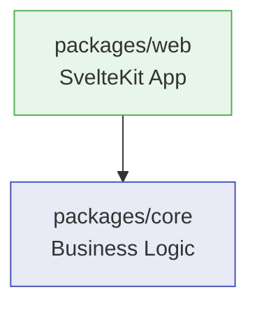

# Development Guide

This guide covers setting up a local development environment, running tests, and understanding the project structure.

## Prerequisites

- **Node.js** 24 or later
- **pnpm** 10 or later (repo uses `packageManager: pnpm@10.33.0`)
- **Git**

## Setup

```bash
# Clone the repository
git clone https://github.com/rknightion/paperless-ngx-dedupe.git
cd paperless-ngx-dedupe

# Install dependencies
pnpm install

# Copy environment configuration
cp .env.example .env
# Edit .env — set PAPERLESS_URL and PAPERLESS_API_TOKEN

# Start the development server
pnpm dev
# Opens at http://localhost:5173
```

!!! warning "Worker Thread Limitation"
    Background jobs (sync, analysis, batch delete, AI processing, AI apply, RAG indexing) use `worker_threads` that run as raw Node.js processes outside Vite. These do **not** work with `pnpm dev` because Node.js cannot execute the TypeScript source files directly. Use `pnpm docker:dev` to test the full workflow including background jobs.

## Project Structure

```
paperless-ngx-dedupe/
├── packages/
│   ├── core/           # Framework-agnostic business logic
│   │   └── src/
│   │       ├── dedup/      # MinHash, LSH, scoring, analysis
│   │       ├── sync/       # Document sync and normalization
│   │       ├── jobs/       # Worker thread management
│   │       ├── queries/    # Database queries (Drizzle ORM)
│   │       ├── schema/     # Database schema definitions
│   │       ├── paperless/  # Paperless-NGX API client
│   │       ├── ai/         # AI metadata extraction and auto-apply
│   │       ├── rag/        # RAG: chunking, embeddings, search
│   │       ├── export/     # CSV and JSON export
│   │       ├── telemetry/  # OpenTelemetry tracing and metrics
│   │       └── config.ts   # Zod-validated environment config
│   ├── web/            # SvelteKit 2 application
│   │   └── src/
│   │       ├── routes/     # UI pages and API endpoints
│   │       └── lib/        # Shared components and utilities
├── docs/               # Documentation (this site)
├── Dockerfile          # Multi-stage Docker build
├── compose.yml         # Development/production compose
└── pnpm-workspace.yaml # Monorepo workspace config
```

## Package Dependencies


```mermaid
graph TD
    Web["packages/web<br/>SvelteKit App"] --> Core["packages/core<br/>Business Logic"]
    style Core fill:#e8eaf6,stroke:#3f51b5
    style Web fill:#e8f5e9,stroke:#4caf50
```

- **core**: No framework dependencies. All business logic lives here.
- **web**: Imports `@paperless-dedupe/core` directly. Serves both the UI and REST API.

## Build Commands

| Command | Description |
|---------|-------------|
| `pnpm dev` | Start SvelteKit dev server at http://localhost:5173 |
| `pnpm build` | Build all packages in order: core, web |
| `pnpm check` | TypeScript type-check all packages |
| `pnpm test` | Run Vitest unit tests (core) |
| `pnpm test:e2e` | Run Playwright E2E tests (requires `pnpm build` first) |
| `pnpm lint` | ESLint check |
| `pnpm lint:fix` | ESLint auto-fix |
| `pnpm format` | Prettier check |
| `pnpm format:fix` | Prettier auto-fix |
| `pnpm docker:dev` | Build and run in Docker via compose.dev.yml |
| `pnpm docker:validate` | Full Docker build + compose integration test |

## Testing

Tests use **Vitest** and are co-located with source files as `*.test.ts` or in `__tests__/` directories.

```bash
# Run all tests once
pnpm test

# Watch mode
pnpm --filter @paperless-dedupe/core test:watch

# Run tests for a specific package
pnpm --filter @paperless-dedupe/core test
```

**Test structure:**

- `packages/core/src/dedup/__tests__/` -- MinHash, LSH, shingles, scoring, discriminative
- `packages/core/src/sync/__tests__/` -- Document sync and normalization
- `packages/core/src/queries/__tests__/` -- Database query tests
- `packages/core/src/paperless/__tests__/` -- Paperless API client tests
- `packages/core/src/jobs/__tests__/` -- Job management tests
- `packages/core/src/ai/__tests__/` -- AI extraction and processing tests
- `packages/core/src/export/__tests__/` -- Export and config backup tests
- `packages/web/src/e2e/` -- Playwright E2E tests (separate from `pnpm test`)

## Code Conventions

- **Formatting**: Prettier -- 100 char width, single quotes, trailing commas, 2-space indent
- **Path aliases**: `@paperless-dedupe/core` resolves to `packages/core/src/index.ts`
- **API routes**: SvelteKit file-based routing at `packages/web/src/routes/api/v1/`
- **Validation**: Zod schemas for environment config and API request bodies
- **Logging**: Pino structured JSON logging
- **Styling**: Tailwind CSS 4 via Vite plugin

## Database

- **Engine**: SQLite via `better-sqlite3`
- **ORM**: Drizzle ORM with schema defined in `packages/core/src/schema/`
- **Migrations**: Auto-detected via SHA-256 hashing of DDL statements. Run on startup when `AUTO_MIGRATE=true` (the default).
- **Tables**: `document`, `documentContent`, `documentSignature`, `duplicateGroup`, `duplicateMember`, `job`, `appConfig`, `syncState`, `aiProcessingResult`, `documentChunk`, `ragConversation`, `ragMessage`

## Docker Development

For testing the full workflow including background jobs:

```bash
# Quick dev mode
pnpm docker:dev

# Full integration validation (build + run)
pnpm docker:validate
```

The **Dockerfile** uses a 3-stage build:

1. **deps** -- Install pnpm dependencies
2. **build** -- Build core + web, deploy with flat node_modules
3. **production** -- Minimal `node:24-slim` runtime with tini init, pre-compiled core (for worker threads), and OTEL preload script

The container runs as a non-root user using `PUID`/`PGID` (defaults: `1000:1000`). Data is persisted at `/app/data` (mounted from `./docker-data` by default). The healthcheck hits `/api/v1/health` on port 3000.
