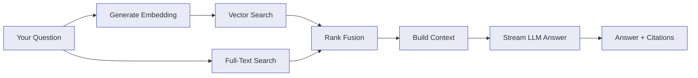

# Document Q&A

Paperless NGX Dedupe can answer natural language questions about your documents using Retrieval-Augmented Generation (RAG). Ask questions like "What was my electricity bill last quarter?" or "Find contracts mentioning penalty clauses" and get answers with citations back to the source documents.

## How It Works

The Q&A system combines **vector search** (semantic similarity) with **full-text search** (exact keyword matching) to find the most relevant document passages, then sends them to a large language model to generate a grounded answer.

### The RAG Pipeline

1. **Indexing** — Your documents' OCR text is split into overlapping chunks (~400 tokens each). Each chunk is converted to a 1536-dimensional vector using OpenAI's embedding model and stored alongside a full-text search index. This happens once per document and is incremental — only new or modified documents are re-indexed.

2. **Retrieval** — When you ask a question, it's converted to a vector and compared against all stored chunks using cosine similarity (via **sqlite-vec**). Simultaneously, the same query runs against the **SQLite FTS5** full-text index. Results from both searches are combined using **Reciprocal Rank Fusion (RRF)**, which produces a single ranked list without needing to calibrate score scales.

3. **Generation** — The top-ranked chunks are assembled into a context prompt and sent to your configured LLM (OpenAI or Anthropic). The model generates an answer grounded in the retrieved context, and the response is streamed token-by-token to the UI.

4. **Citations** — Each answer includes source citations showing which documents contributed to the response, with relevance scores and text excerpts.

### Why Hybrid Search?

Vector search excels at understanding meaning ("electricity costs" matches "energy bill") but can miss exact terms. Full-text search is precise for specific identifiers (invoice numbers, names) but misses paraphrases. Combining both gives the best of both worlds — especially important for OCR text which may contain noise.

### Zero Extra Infrastructure

Unlike most RAG systems that require a separate vector database (Qdrant, Pinecone, etc.), Document Q&A uses **sqlite-vec** — a SQLite extension that stores vectors directly in your existing database file. No additional containers, no separate backups, no extra configuration.

## Setup

Document Q&A is disabled by default. Enable it with environment variables:

| Variable | Required | Default | Notes |
| --- | --- | --- | --- |
| `RAG_ENABLED` | No | `false` | Master switch for Document Q&A |
| `AI_OPENAI_API_KEY` | Yes (when enabled) | - | Required for generating embeddings |
| `AI_ANTHROPIC_API_KEY` | No | - | Required only if using Anthropic as the answer model |

!!! note "OpenAI key always required"
    Embeddings always use OpenAI's `text-embedding-3-small` model, regardless of which provider you choose for generating answers. The OpenAI key is therefore mandatory when `RAG_ENABLED=true`.

`RAG_ENABLED` is independent of `AI_ENABLED` — you can use Document Q&A without enabling AI classification, or vice versa.

## Configuration

After enabling, configure Q&A behavior in **Settings > Document Q&A** or via `PUT /api/v1/rag/config`. All settings are stored in the database and take effect immediately.

### Embedding Settings

| Setting | Default | Range | Description |
| --- | --- | --- | --- |
| `embeddingModel` | `text-embedding-3-small` | see below | OpenAI embedding model |
| `embeddingDimensions` | `1536` | 256–3072 | Vector dimensions (lower = less storage, slightly less accuracy) |

**Available embedding models:**

| Model | Dimensions | Cost | Notes |
| --- | --- | --- | --- |
| `text-embedding-3-small` | 1536 | $0.02/1M tokens | Best cost/performance ratio (recommended) |
| `text-embedding-3-large` | 3072 | $0.13/1M tokens | Higher quality, 6.5× more expensive |

### Chunking Settings

| Setting | Default | Range | Description |
| --- | --- | --- | --- |
| `chunkSize` | `400` | 100–2000 | Target tokens per chunk |
| `chunkOverlap` | `40` | 0–500 | Overlap tokens between consecutive chunks |

### Retrieval Settings

| Setting | Default | Range | Description |
| --- | --- | --- | --- |
| `topK` | `10` | 1–50 | Number of chunks retrieved per query |
| `maxContextTokens` | `4000` | 500–100,000 | Max tokens of retrieved context sent to the answer model |

### Answer Model

The model that generates answers from retrieved context is configured independently from AI Processing:

| Setting | Default | Range | Description |
| --- | --- | --- | --- |
| `answerProvider` | `openai` | `openai`, `anthropic` | LLM provider for answers |
| `answerModel` | `gpt-5.4-mini` | see [AI Processing](ai-processing.md#available-models) | Model identifier |
| `systemPrompt` | built-in | string | System instructions for the answer model |
| `autoIndex` | `false` | boolean | Auto-run indexing after document sync |

## Indexing Documents

Before you can ask questions, your documents must be indexed. Indexing converts document text into vector embeddings and builds the full-text search index.

### Starting Indexing

There are three ways to index:

1. **Manual** — Click "Index Now" on the `/ask` page or "Rebuild Index" in Settings
2. **Auto-index** — Enable `autoIndex` in settings to automatically index after each sync
3. **API** — `POST /api/v1/rag/index`

### Incremental vs. Full Rebuild

By default, indexing is **incremental** — only documents that are new or whose content has changed since last indexing are processed. To force a full re-index (useful after changing the embedding model or dimensions), use the "Rebuild Index" button in Settings or pass `{ "rebuild": true }` to the API.

!!! warning "Changing embedding model requires a rebuild"
    If you change `embeddingModel` or `embeddingDimensions`, you must rebuild the index. Old embeddings are incompatible with the new model and search results will be poor until the index is rebuilt.

### Cost Estimation

Embedding costs depend on the model and total document text:

- **text-embedding-3-small**: ~$0.02 per 1M tokens
- A typical 500-word document is ~625 tokens
- 1,000 documents ≈ 625K tokens ≈ **$0.01**
- 10,000 documents ≈ 6.25M tokens ≈ **$0.13**

Incremental indexing only processes new or changed documents, so recurring costs are minimal.

## Using the Q&A Interface

Navigate to **Ask Documents** in the sidebar to open the chat interface.

### Asking Questions

Type your question in the input bar and press Enter or click the send button. The answer streams in token-by-token with a typing indicator.

Tips for effective questions:

- **Be specific** — "What was my British Gas electricity bill for Q1 2024?" works better than "electricity bills"
- **Reference document types** — "Find all invoices from Amazon" uses both semantic and keyword matching
- **Ask about content** — "What are the penalty clauses in my lease agreement?" searches inside documents, not just titles

### Source Citations

Each answer includes expandable source citations showing:

- **Document title** — which document the information came from
- **Excerpt** — the relevant text passage
- **Match score** — how relevant the passage was to your question

### Conversations

Conversations are persisted in the database. The sidebar shows past conversations ordered by most recent, with the ability to:

- Resume any past conversation
- Start a new conversation
- Delete conversations you no longer need

Multi-turn conversations maintain context — follow-up questions can reference earlier parts of the conversation.

## Tips

!!! info "Best practices"
    - **Index before asking** — The Q&A feature requires indexed documents. If you see zero chunks, run indexing first.
    - **Start with the default settings** — The defaults work well for most document libraries. Tune only if retrieval quality is poor.
    - **Increase `topK` for broad questions** — Questions spanning many documents benefit from more retrieved chunks (15–20). Narrow questions work fine with fewer (5–10).
    - **Increase `maxContextTokens` for detailed answers** — If answers are too brief or miss details, increase the context budget. Be aware this increases per-query token costs.
    - **Use a powerful answer model** — Unlike batch classification where cost matters, Q&A is interactive and benefits from stronger models. Consider `gpt-5.4` or `claude-sonnet-4-6` for best results.
    - **Enable auto-index** — If you sync documents regularly, enabling auto-index keeps the search index up to date automatically.

!!! tip "Hybrid search for OCR documents"
    OCR text often contains errors (misread characters, merged words). The hybrid search approach is particularly valuable here — vector search understands meaning despite typos, while full-text search catches exact terms the vector search might miss.

## Technical Details

### Storage

All RAG data is stored in the same SQLite database file:

- **`document_chunk`** — Chunk text, metadata, and content hash (Drizzle-managed table)
- **`document_chunk_vec`** — Vector embeddings (sqlite-vec virtual table)
- **`document_chunk_fts`** — Full-text search index (SQLite FTS5 virtual table)
- **`rag_conversation`** — Conversation sessions
- **`rag_message`** — Chat messages with source citations

### Scale Considerations

sqlite-vec uses linear scan (no approximate nearest neighbor indexes). Performance by collection size:

| Documents | Approximate Chunks | Query Latency |
| --- | --- | --- |
| < 1,000 | < 5K | < 10ms |
| 1,000–10,000 | 5K–50K | < 50ms |
| 10,000–50,000 | 50K–250K | < 200ms |
| 50,000–100,000 | 250K–500K | < 500ms |

For most Paperless-NGX installations (< 50K documents), performance is excellent.

### Search Fusion Algorithm

Reciprocal Rank Fusion (RRF) combines results from vector and full-text search:

$$\text{score}(d) = \sum_{i} \frac{1}{k + \text{rank}_i(d)}$$

Where $k = 60$ (standard constant) and $\text{rank}_i(d)$ is the rank of document $d$ in result set $i$. Documents appearing in both result sets receive higher fused scores.

## See Also

- [AI Processing](ai-processing.md) — LLM-powered document classification
- [Configuration](configuration.md) — environment variables and runtime settings
- [API Reference](api-reference.md#document-qa) — Q&A REST API endpoints
