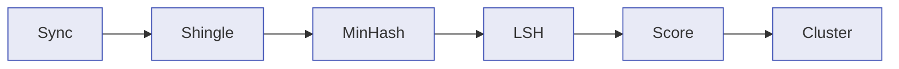

# How It Works

Paperless-Dedupe uses a multi-stage pipeline to identify duplicate documents efficiently. This page explains each stage in plain terms.

## Overview

The pipeline works in three broad phases:

1. **Sync** documents from Paperless-NGX and prepare their text
2. **Index** documents using probabilistic data structures (MinHash + LSH) to find candidate pairs without comparing every document to every other
3. **Score and group** candidates using multiple similarity dimensions, then cluster them for review

## Step 1: Document Sync

When you trigger a sync, Paperless-Dedupe fetches documents from your Paperless-NGX instance via its REST API.

For each document, the sync process:

- Stores metadata (title, correspondent, document type, tags, dates, file sizes)
- Extracts the full OCR text content
- Normalizes the text: lowercases, strips punctuation, collapses whitespace
- Computes a fingerprint (hash of the normalized text) so future syncs can skip unchanged documents

After the first full sync, incremental syncs only fetch documents that have changed.

## Step 2: Shingling

Before comparing documents, the normalized text is split into overlapping word groups called **shingles** (also known as n-grams).

With the default `ngramSize` of 3, the sentence "the quick brown fox jumps" produces these shingles:

- "the quick brown"
- "quick brown fox"
- "brown fox jumps"

Each document becomes a **set of shingles**. Two documents that share many shingles have similar content, measured by the Jaccard similarity:

\[
J(A, B) = \frac{|A \cap B|}{|A \cup B|}
\]

The shingle set is the foundation for all subsequent steps.

Documents with fewer words than `minWords` (default: 20) are skipped because short documents produce too few shingles for reliable comparison.

## Step 3: MinHash Signatures

Comparing shingle sets directly is expensive -- each set can contain thousands of entries, and comparing every pair of documents would be O(n^2).

MinHash compresses each shingle set into a compact fixed-size **signature** (a list of 192 numbers by default, controlled by `numPermutations`). The key property is:

> The probability that two MinHash signatures agree at any position equals the Jaccard similarity of the original shingle sets.

This means we can estimate how similar two documents are by comparing their short signatures instead of their full shingle sets. The more permutations, the more accurate the estimate, but at the cost of more memory and CPU.

## Step 4: Locality-Sensitive Hashing (LSH)

Even with compact signatures, comparing every pair of documents is still O(n^2). LSH solves this by only comparing documents that are **likely** to be similar.

The technique works by dividing each signature into **bands** (default: 20). Each band is a short segment of the signature. Documents are placed into hash buckets based on each band. Two documents that land in the same bucket for _any_ band become a **candidate pair**.

The band/row structure creates an S-curve probability threshold:

- Document pairs with high similarity are almost certain to be candidates
- Pairs with low similarity are almost certain to be filtered out
- The transition region depends on the number of bands and rows per band

With 192 permutations and 20 bands, the effective threshold for candidate detection is around 50-60% Jaccard similarity. The `similarityThreshold` parameter (default: 0.75) then filters scored pairs to a higher bar.

## Step 5: Similarity Scoring

Each candidate pair from LSH is scored across four dimensions:

1. **Jaccard Similarity** (default weight: 40%) -- Set overlap of shingle sets, estimated from MinHash signatures. Measures how much text content the two documents share.

2. **Fuzzy Text Similarity** (default weight: 30%) -- Edit-distance-based ratio computed on a character sample of the normalized text (controlled by `fuzzySampleSize`). Catches cases where documents have similar content but different word order or minor variations.

3. **Metadata Similarity** (default weight: 15%) -- Compares correspondent, document type, creation date, and file size. Documents from the same source with similar dates are more likely to be duplicates.

4. **Filename Similarity** (default weight: 15%) -- String similarity between document titles. Useful for catching re-uploads or scans with auto-generated names.

The overall confidence score is the weighted combination of all four dimensions. Pairs scoring below `similarityThreshold` (default: 0.75) are discarded.

## Step 6: Clustering

Scored pairs are grouped into clusters using a **union-find** (disjoint-set) data structure. If document A is similar to B, and B is similar to C, all three end up in the same group -- even if A and C were not directly compared.

Each cluster becomes a **duplicate group** in the database with:

- A confidence score (derived from the strongest pair in the group)
- Individual similarity dimension scores
- Member documents with a designated primary (the one to keep)

Groups are presented in the web UI for review, sorted by confidence.

## Tuning Guide

### Too many false positives (unrelated documents grouped together)

- **Raise `similarityThreshold`** (e.g., 0.85 or 0.90) to require stronger matches
- **Increase `confidenceWeightJaccard`** to rely more on actual text overlap
- **Reduce `numBands`** to narrow the LSH candidate funnel

### Missing obvious duplicates

- **Lower `similarityThreshold`** (e.g., 0.60) to allow weaker matches through
- **Increase `numBands`** to widen the candidate funnel
- **Lower `minWords`** if short documents are being skipped
- **Check `ngramSize`** -- a smaller value (2) is more sensitive to small differences

### Slow analysis on large libraries

- **Reduce `numPermutations`** (e.g., 128) for faster signature generation at the cost of some accuracy
- **Reduce `fuzzySampleSize`** (e.g., 2000) to speed up fuzzy text comparison
- **Increase `similarityThreshold`** to reduce the number of pairs that need scoring

### Understanding the relationship between bands and permutations

`numPermutations` must be evenly divisible by `numBands`. The number of rows per band is `numPermutations / numBands`. More rows per band means a higher effective LSH threshold (fewer candidates, higher precision). More bands means a lower effective threshold (more candidates, higher recall).

| Permutations | Bands | Rows/Band | Approximate LSH Threshold |
| ------------ | ----- | --------- | ------------------------- |
| 192          | 20    | ~10       | ~55%                      |
| 192          | 32    | 6         | ~45%                      |
| 128          | 16    | 8         | ~55%                      |
| 256          | 32    | 8         | ~55%                      |

## See Also

- [Architecture](architecture.md) -- monorepo structure, data flow diagrams, and database schema
- [Configuration](configuration.md) -- all algorithm parameters with ranges and defaults
